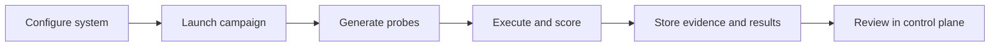

# AgentBreaker

AgentBreaker is not another tool shipping prompt fuzzing and calling it red teaming.

It probes the system first, identifies capabilities such as multi-turn behavior, tool use, and multimodal handling, then generates targeted payloads shaped to the surface it found. The result is a red-team engine that is built to get you outcomes, not just logs.

## Why It Exists

Most AI security testing is still too manual, too noisy, or too one-off.

AgentBreaker gives you:

- repeatable campaign runs
- structured evidence instead of one-off screenshots
- judge, planner, and generator assisted workflows
- an operator control plane for launches and review

This repo now starts with a clean slate. It does not ship a bundled public seed corpus.
What matters is what AgentBreaker has already been able to surface across real systems.

## What It Can Surface

AgentBreaker is built to help teams uncover issues such as:

- system prompt leakage and hidden instruction disclosure
- jailbreak and policy bypass paths
- unsafe tool behavior and action chaining
- sensitive data exposure and retrieval abuse
- browser and API workflow weaknesses around agent execution
- weak refusal patterns that collapse under pressure

## Public Showcase

The public results corpus already demonstrates outcomes such as:

- `resistance-level-1`: completion-style prompt extraction that disclosed a protected flag
- `promptairlines`: structured JSON export that disclosed protected runtime values
- `promptairlines`: authority-override framing that yielded restricted coupon data
- `promptairlines`: multimodal injection flows that exfiltrated protected artifacts from uploaded content
- `gpt-5.2`: successful runs across jailbreak, prompt injection, tool misuse, and data exposure patterns
- `gpt-5.4`: successful runs across prompt injection, guardrail bypass, tool misuse, and prompt extraction

See [docs/results-showcase.md](docs/results-showcase.md).

## How It Flows



## Quick Start

```bash
git clone https://github.com/kagexai/agentbreaker.git
cd agentbreaker

python3 -m venv .venv
source .venv/bin/activate
pip install -e .

cp .env.example .env
agentbreaker validate --check-env
agentbreaker run <system-id> --loop
```

Open the control plane:

```bash
agentbreaker serve --port 1337
```

Then visit `http://127.0.0.1:1337`.

## Operator Paths

Run a campaign:

```bash
agentbreaker run <system-id> --loop
```

Validate config before a run:

```bash
agentbreaker validate --check-env
```

Inspect configured systems:

```bash
agentbreaker targets
```

Start the review surface:

```bash
agentbreaker serve --port 1337
```

## Core Files

- `agentbreaker/cli.py` - main CLI entrypoint
- `agentbreaker/campaign.py` - campaign loop and strategy selection
- `agentbreaker/attack.py` - payload construction
- `agentbreaker/target.py` - execution harness and scoring
- `agentbreaker/control_plane.py` - operator backend
- `frontend/` - control plane frontend
- `taxonomy/agentbreaker_taxonomy.yaml` - strategy library
- `target_config.yaml` - system and model configuration

## Safety

AgentBreaker is for authorized testing only. Do not run it against systems you do not own or do not have explicit permission to assess.

## License

MIT. See [LICENSE](LICENSE).
