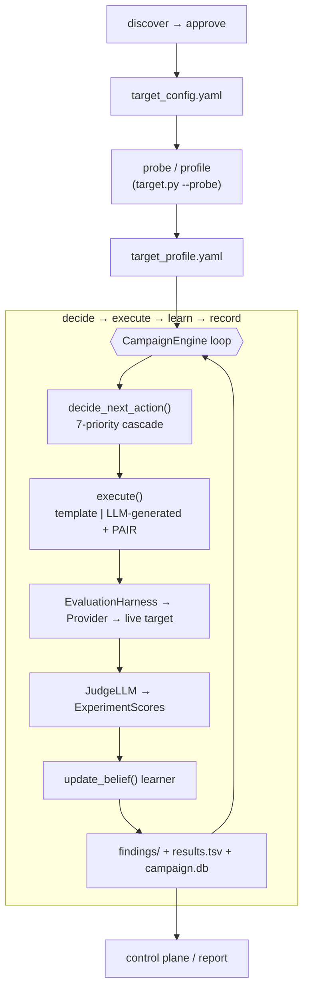
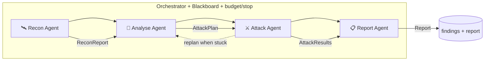

# AgentBreaker Architecture

This document describes **what AgentBreaker is today** and the **proposed shift to a
staged multi-agent architecture** (recon → analyse → attack → report).

---

## Part 1 — Current architecture

AgentBreaker today is a **single heuristic attack loop with LLM assists**. A profiler
maps the target, then one engine repeatedly decides-executes-judges-learns until stopped.
The "intelligence" is a belief state plus three LLM helpers (planner, generator, judge);
the control flow is a fixed 7-priority decision cascade, not autonomous reasoning.

### 1.1 Layers and modules

| Layer | Modules | Responsibility |
|-------|---------|----------------|
| **Discovery** | `discovery/` (engine, sources, approve) | Find new CTFs/models, dedup, propose candidates. Discover-only; approval registers a target. |
| **Config / Targets** | `config_schema.py`, `target_config.yaml`, `platforms.yaml` | Target + provider definitions, authorization, capabilities. |
| **Providers** | `providers/` (script/http/browser), `ProviderRouter` (`target.py`) | Send a payload to the live target, return a response. |
| **Recon / Profiling** | `target.py --probe` (`_cmd_probe`, `_PROBE_SEQUENCES`, `_active_capability_discovery`, `_synthesize_profile`) | Probe the target, judge-synthesize `target_profile.yaml`. |
| **Attack engine** | `campaign_engine.py` (default), `campaign.py` (legacy loop + helpers) | The decide→execute→learn→record loop. |
| **Attack generation** | `attack.py` (templates), `attack_generator.py` (LLM + PAIR), `attack_planner.py` (LLM planner) | Produce payloads. |
| **Knowledge** | `taxonomy_loader.py`, `arc_taxonomy.py`, `taxonomy/`, `seed_manager.py`, `response_analysis.py`, `domain_helpers.py`, `ctf_state.py` | Attack taxonomy, seeds/canaries, response clustering, CTF stage state. |
| **Scoring** | `JudgeLLM` + `ExperimentScores` (`target.py`) | Score each trial: vulnerability/novelty/reliability/composite, breach, failure_mode, gradient. |
| **Evidence / Reporting** | `findings/` (success/partial/novel), `results.tsv`, `attack_log.jsonl`, `db.py` (`campaign.db`), `control_plane.py` + `frontend/` | Persist and review results. |

### 1.2 End-to-end flow



### 1.3 The decision loop (the part being replaced)

`CampaignEngine.decide_next_action()` chooses the next single payload via a fixed priority
cascade: **warm vector → judge recommendation → chain from leak → LLM planner → taxonomy
exploration → LLM generator → fallback (cycle strategies/variants)**. The belief state
(`BeliefState`) tracks per-strategy scores, warm vectors, partial extractions, cooled
strategies, and stall. `update_belief()` is the learner.

**Why this is "brute force":** the engine has no model of *the target as a whole*. It picks
one payload, scores it, nudges the belief, and repeats. Strategy selection is heuristic
priority + variant cycling. The LLM is a *tool the loop calls*, not a planner that owns the
campaign. There is no explicit recon→analyse→attack→report separation and no agent that
reasons about which class of attack the target's capabilities actually warrant.

### 1.4 Strengths to preserve in any redesign

- **Provider abstraction** (`ProviderRouter`, `providers/`) — clean target I/O.
- **Harness + JudgeLLM + `ExperimentScores`** — solid execution + scoring with audit log.
- **Belief state + persistence** (`belief_state.json`) — learned intelligence across runs.
- **Taxonomy / seeds / templates** — a rich library of attack knowledge.
- **Findings tiers + DB + control plane** — evidence pipeline and operator UI.
- **Infra-failure handling, dedup, warm-vector decay** — recent engine hardening.

---

## Part 2 — Proposed staged multi-agent architecture

Replace the monolithic loop with **four cooperating agent stages**, each an LLM-driven
agent (with sub-agents) that owns a phase and hands a typed contract to the next:

> **Recon → Analyse → Attack → Report**, coordinated by an **Orchestrator** over a shared
> **Campaign Blackboard**, with bounded **loop-back** (Attack can request an Analyse replan).

The existing harness, providers, taxonomy, judge, belief state, and findings pipeline are
**reused as tools** the agents call — we are changing *who decides*, not *how payloads are
sent or scored*.

### 2.1 Stage overview



### 2.2 Stages, sub-agents, and contracts

Each stage produces a **typed, schema-validated contract** (dataclass). Sub-agents are
focused LLM calls or tool pipelines run by the stage.

**🛰 Recon Agent** — *understand the target* (wraps `target.py` profiling, made adaptive).
- Sub-agents: **Capability Prober** (multi-turn / tools / vision / RAG / document),
  **Surface Mapper** (domain entities, sensitive fields, persona/domain),
  **Guardrail Profiler** (refusal phrases, blocker fingerprints, response clusters).
- Tools: `provider.probe()`, `_active_capability_discovery`, `JudgeLLM` synthesis.
- **Output `ReconReport`**: `{capabilities, attack_surface[ranked], guardrails, persona,
  domain, deployment_type, notes}` — a superset of today's `target_profile.yaml`.

**🧠 Analyse Agent** — *decide what attacks fit* (this is the brain that replaces the cascade).
- Sub-agents: **Threat Modeler** (map capabilities → applicable OWASP LLM / taxonomy
  categories), **Strategy Planner** (choose attack vectors + per-objective hypotheses +
  success criteria), **Prioritizer** (rank objectives by expected value vs. cost).
- Tools: `taxonomy_loader`, `arc_taxonomy`, prior `findings/` + belief, `applicable_categories`.
- **Output `AttackPlan`**: ordered `AttackObjective[]`, where an objective is
  `{target_field, category, strategy_family, hypothesis, success_criteria, budget}`.
  Objectives, not single payloads — the Attack agent owns tactics within an objective.

**⚔ Attack Agent** — *execute and adapt per objective* (reuses the engine internals).
- Per-objective sub-agents: **Payload Crafter** (LLM shapes payloads to the objective,
  using `generate_template_payload` + `attack_generator` as tools), **Executor**
  (`EvaluationHarness.run_experiment`), **Refiner** (PAIR loop on judge feedback),
  **Critic** (`JudgeLLM` → `ExperimentScores`).
- Keeps **belief state** (warm vectors, chaining, infra-exclusion, dedup) but **scoped to
  the objective** and driven by agent reasoning, not a global priority cascade.
- **Output `AttackResults`**: per-objective outcomes + evidence refs + updated belief.
  May emit a **replan signal** to the Orchestrator when an objective is exhausted or a
  new surface is discovered mid-attack.

**📋 Report Agent** — *synthesize findings* (new explicit stage).
- Sub-agents: **Evidence Synthesizer** (write/merge `findings/` YAML, dedup),
  **Risk Mapper** (OWASP/benchmark mapping, severity), **Narrative Writer** (exec
  summary, reproduction steps, remediation).
- Tools: `_write_finding`, `db.py`, taxonomy refs.
- **Output `Report`**: structured Markdown/PDF + findings tiers, surfaced in the control plane.

### 2.3 Cross-cutting design

**Runtime: LangGraph** (confirmed). The pipeline is a LangGraph `StateGraph` whose **nodes
are stages**, **edges are transitions**, **conditional edges are loop-back**, and **state is
the Campaign Blackboard**. LangGraph is orchestration-only — it does *not* make LLM calls
for us — so the agents keep using the existing provider-agnostic `_call_llm` / `JudgeLLM`
clients (`openai` / `anthropic` / `openai-compatible` / local all keep working). LangGraph
is an **optional extra** (`pip install agentbreaker[agents]`), lazily imported, so the core
tool is unaffected when it isn't installed.

```python
# agents/graph.py (shape)
g = StateGraph(CampaignBlackboard)
g.add_node("recon", recon_stage); g.add_node("analyse", analyse_stage)
g.add_node("attack", attack_stage); g.add_node("report", report_stage)
g.set_entry_point("recon")
g.add_edge("recon", "analyse"); g.add_edge("analyse", "attack")
g.add_conditional_edges("attack", route_after_attack, {"replan": "analyse", "done": "report"})
g.add_edge("report", END)
```

- **Orchestrator** = the compiled graph + a thin `runner.py`. It owns the Blackboard,
  enforces **budget** (token/experiment/time) and **stop conditions** (breach found,
  coverage target, plan exhausted), and mediates **bounded loop-back** via
  `route_after_attack` (caps replans at `max_replans`). Replaces `CampaignEngine.run()` as
  the top-level controller (the engine survives as the Attack executor — see migration).
- **Campaign Blackboard** (`agents/blackboard.py`): the LangGraph state object (a
  `TypedDict`/dataclass) holding `target_id`, config, the stage contracts (`recon`, `plan`,
  `results`, `report`), `budget`, `replan_count`, and stop flags. Extends/embeds today's
  `BeliefState` and reuses its `belief_state.json` persistence.
- **Agent base** (`agents/base.py`): `Agent` with a role/system prompt, a **tool registry**,
  and **structured I/O** (JSON-schema-validated via `_call_llm` / `JudgeLLM` — no new LLM
  dependency). Tools are thin wrappers over existing functions, so agents never see
  subprocesses or raw providers.
- **Tools, not brute force**: taxonomy, templates, generator, harness, and probes become
  *tools an agent selects deliberately* based on recon/analysis — replacing strategy/variant
  cycling. The agent reasons "this target has vision + a coupon field, so multimodal
  exfiltration is high-value" instead of iterating the whole strategy list.

### 2.4 Stage contracts (sketch)

```python
@dataclass
class ReconReport:
    capabilities: dict          # has_tools/vision/rag/multi_turn/document
    attack_surface: list[dict]  # ranked: {field, category, reason, priority}
    guardrails: dict            # refusal_phrases, blocker_fingerprints, clusters
    persona: str; domain: str; deployment_type: str
    notes: list[str]

@dataclass
class AttackObjective:
    target_field: str; category: str; strategy_family: str
    hypothesis: str; success_criteria: str; budget: int

@dataclass
class AttackPlan:
    objectives: list[AttackObjective]   # ordered by priority
    rationale: str

@dataclass
class AttackResults:
    per_objective: list[dict]   # objective + outcome + evidence refs + best score
    replan_requested: bool; new_surface: list[str]

@dataclass
class Report:
    summary: str; findings: list[dict]   # severity, OWASP, repro, remediation
    coverage: dict
```

### 2.5 Migration path (incremental, both engines coexist)

Add an `--engine staged` flag (alongside today's default in-process engine and
`--legacy-engine`) so the new pipeline can be developed and A/B-tested without regressions.

0. **Scaffold** ✅ *(implemented)*: `agents/` package — contracts (`ReconReport`,
   `AttackObjective`, `AttackPlan`, `AttackResults`, `Report`), `CampaignBlackboard`,
   the four stage nodes, the LangGraph graph + a no-dep fallback orchestrator, and
   `--engine staged` wiring. Phase-0 stages are deterministic (recon from profile,
   capability-gated objective planning, engine-backed Attack executor, findings synthesis)
   so the pipeline runs and is fully tested offline (`tests/test_agents.py`). Next phases
   swap each deterministic stage for its LLM agent.
1. **Analyse Agent** ✅ *(Phase 1)*: the pivotal change — an LLM reasons over recon to a
   focused, prioritized `AttackPlan` with per-objective hypotheses (deterministic
   capability-gated mapping as fallback). Removes the brute-force strategy selection.
2. **Attack Agent** ✅ *(Phase 2, opt-in `--attacker agent`)*: per-objective
   reason→craft→execute→reflect loop. A Payload Crafter LLM proposes each attack tied to
   the hypothesis and adapts on judge feedback; reuses the engine's harness/scoring/
   recording. The default `--attacker engine` is the tuned belief loop (LLM generator
   active from attack #1, fewer trials).
3. **Recon Agent** ✅ *(Phase 3)*: LLM enrichment over the profile-derived baseline —
   surfaces hidden high-value fields and likely guardrail weak points the flat profile
   missed; merged + capability-gated. Deterministic baseline as fallback.
4. **Report Agent** ✅ *(Phase 4)*: LLM narrative over the structured outcomes — executive
   summary + per-finding severity/OWASP/remediation. Deterministic summary as fallback.
5. **Deprecate** the standalone cascade once staged is at parity; keep `--legacy-engine`.

All four stage agents share `agents/base.Agent` (role prompt + provider-agnostic
`_call_llm` + JSON-schema-ish output) and degrade to deterministic behavior with no key,
so the pipeline always runs and is fully offline-testable (LLM mocked in tests).

### 2.6 What changes vs. what stays

| Stays (reused as tools) | Changes (new agent control) |
|--------------------------|------------------------------|
| Providers + `ProviderRouter` | `decide_next_action` cascade → **Analyse Agent** plan |
| `EvaluationHarness` + `JudgeLLM` + `ExperimentScores` | Profiling → **Recon Agent** (adaptive, contract output) |
| Belief state + `belief_state.json` | Global loop → **Orchestrator** stage machine + loop-back |
| Taxonomy / seeds / templates / generator | Implicit reporting → **Report Agent** |
| Findings tiers + DB + control plane | Strategy/variant cycling → deliberate tool selection |

---

*See also: `agentbreaker/campaign_engine.py` (current engine), `agentbreaker/target.py`
(harness/profiling), `agentbreaker/discovery/` (target discovery).*
